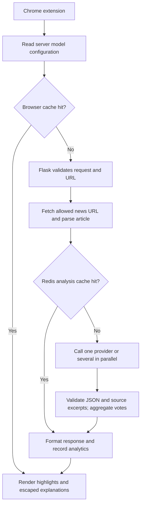

# News Literacy Analyzer

A Python service and Chrome extension for exploring Korean news articles through
selected passages and explanations of their value for critical reading.
Development is continuing on the existing project: the current maintenance work
repairs the analysis pipeline, refreshes model integrations, and improves local operation.

## Current status

- The HTTP service supports single-provider analysis and parallel comparison across providers.
- The extension highlights returned passages and displays selection reasons.
- The intended runtime is a **local, trusted-user application**. Public deployment needs additional work.
- Model integration and extension changes are implemented but **have not been tested against live APIs or a real browser**.
- The recorded 158 Python and 2 JavaScript test passes belong to an earlier runtime repair snapshot.
  Tests have not been rerun after the model refresh. Container execution and hosted CI are also pending.

Start with [local operation instructions](docs/OPERATIONS.md),
[maintenance notes](docs/MAINTENANCE_NOTES.md), and the
[engineering walkthrough](docs/ENGINEERING_GUIDE.md).

## How a request works



The server currently crawls the article **before** checking its analysis cache.
A browser cache hit avoids the analysis request; a Redis hit avoids model calls
but still involves fetching and parsing the article.

Model agreement measures selection overlap. It does not establish factual accuracy
or the educational quality of the explanations.

## Project structure

The tree below shows the main tracked components; generated caches, logs and databases are omitted.

```text
journalism-and-literacy-kor/
├── chrome-ex/
│   ├── manifest.json                 # Extension permissions and entry points
│   ├── background.js                 # HTTP requests and browser cache
│   ├── content.js                    # Passage matching, highlights and tooltips
│   ├── settings.html / settings.js   # Analysis mode and provider selection
│   └── popup.html / popup.js         # Extension controls
├── scripts/
│   ├── server.py                     # Flask routes and service composition
│   ├── api/                          # Validation, errors and middleware
│   ├── services/                     # Crawling, analysis, cache and health services
│   ├── url_safety.py                 # Allowed URLs, DNS checks and bounded fetching
│   ├── crawler_unified.py            # Active parser routing
│   ├── crawler.py                    # Generic Readability extraction
│   ├── crawler_*.py                  # Publisher-specific parser modules
│   ├── crawlers/                     # Separate plugin framework retained from earlier work
│   ├── consensus_analyzer.py         # Parallel calls and sentence-vote aggregation
│   ├── llm/
│   │   ├── base.py / factory.py      # Provider contract and construction
│   │   ├── config.py                 # Model defaults, alternatives and cache fingerprint
│   │   ├── providers/               # Gemini, OpenAI, Claude, Mistral and Llama adapters
│   │   └── prompts/                 # Active extraction prompt and prompt utilities
│   ├── observability/                # Logs, correlation IDs and metrics
│   ├── database/                     # SQLAlchemy models, sessions and repositories
│   ├── config/                       # Environment-backed settings
│   ├── benchmark/                    # Older offline prompt-evaluation framework
│   ├── tools/                        # Local administrative utilities
│   └── native_host.py                # Legacy native-messaging entry point
├── benchmarks/
│   ├── fixture_app.py                # HTTP benchmark with fake upstreams
│   ├── http_load.py                  # Load and shutdown experiment driver
│   └── records/                      # Historical raw measurements and test output
├── tests/
│   ├── unit/                        # Component checks
│   ├── integration/                 # Service workflow checks
│   ├── regression/                  # Request, URL-safety and failure regressions
│   └── extension.test.cjs            # JavaScript regression checks
├── prompts/                         # Earlier research prompts and baselines
├── data/                            # Article schema, dataset and sample HTML
├── docs/                            # Maintenance, operation and engineering guides
├── install/                         # Earlier installation/native-messaging scripts
├── .github/workflows/checks.yml     # Authored regression and container jobs
├── .env.example                     # Local configuration template
├── requirements-runtime.txt         # API runtime dependencies
├── requirements-dev.txt             # Runtime plus test dependencies
├── requirements.txt                 # Broader research dependencies
├── gunicorn.conf.py                 # One process, eight HTTP threads by default
├── Dockerfile
└── docker-compose.yml               # API and Redis with loopback port publishing
```

The active HTTP route uses `scripts/crawler_unified.py`, not the separate
`scripts/crawlers/` plugin registry. The Chrome extension uses HTTP; it does not
require the legacy native-messaging installer.

## Local setup

Use Python 3.12 for the documented runtime. Node.js 22 is used by the JavaScript
checks; Chrome is needed for the extension. Redis is optional.
Run the following from the repository root on macOS or Linux:

```sh
python3.12 -m venv .venv
.venv/bin/python -m pip install -r requirements-runtime.txt
```

Create `.env` from `.env.example` if you do not already have one. Keep your existing
configuration when upgrading. Set a real API key for each provider you select,
remove unused placeholder keys, and replace the sample `ADMIN_TOKEN` with a random secret.
For operation without Redis, set both `CACHE_ENABLED=False` and `ENABLE_CACHE=False`.
The `.env` file is ignored by Git.

```sh
.venv/bin/python -m gunicorn --pythonpath scripts --config gunicorn.conf.py server:app
```

The default listener is `127.0.0.1:5001`. Gunicorn uses `BIND` to override this;
`FLASK_HOST` and `FLASK_PORT` apply to the development server started with
`.venv/bin/python scripts/server.py`.

For the extension:

1. Open `chrome://extensions` and enable Developer mode.
2. Load `chrome-ex/` as an unpacked extension.
3. Open extension settings and select one provider, or at least two for consensus mode.
4. Open an HTTPS article on an allowed publisher domain.
5. Reload the extension after changing its files. If you change the API port,
   update `background.js` and the corresponding permission in `manifest.json`.

`docker compose up --build` is the alternative container workflow. Its image and
runtime have not yet been verified locally. See [operations](docs/OPERATIONS.md)
for configuration, shutdown and troubleshooting details.

## Model configuration

These are the model IDs currently configured in the code, reviewed on 2026-10-04.
Account access and Korean extraction quality still require live evaluation.

| Provider | Default model | Alternative / status |
|---|---|---|
| Gemini | `gemini-3.5-flash-lite` | `gemini-3.1-flash-lite` |
| OpenAI | `gpt-6-luna` | Uses `reasoning_effort=none` for this extraction task |
| Mistral | `ministral-8b-2512` | `ministral-3b-2512` for the smaller candidate |
| Claude | `claude-haiku-4-5-20251001` | Pinned model ID |
| Llama | `meta-llama/Llama-3.1-8B-Instruct` | Legacy Together adapter; hosted availability unverified |

Configure `<PROVIDER>_API_KEY` and `<PROVIDER>_MODEL` in `.env`, for example
`MISTRAL_MODEL=ministral-3b-2512`. Existing environment settings override code defaults.
Restart the server after configuration changes. Defaults include a 2,048-token
output cap and a 40-second provider timeout; supported options differ by provider.
The `LLM_MAX_RETRIES` setting is not a uniform retry policy across all adapters.

The HTTP API selects providers; each provider uses its server-configured model.
Compare Mistral 3B and 8B in separate runs. They are not two independent entries
in the same consensus request. Provider API keys remain on the server.

Reference catalogs:
[Gemini](https://ai.google.dev/gemini-api/docs/models/gemini-3.5-flash-lite),
[OpenAI](https://developers.openai.com/api/docs/models/gpt-6-luna),
[Ministral 8B](https://docs.mistral.ai/models/ministral-3-8b-25-12),
[Ministral 3B](https://docs.mistral.ai/models/ministral-3-3b-25-12), and
[Claude](https://platform.claude.com/docs/en/models/haiku-4-5/overview).
These sources describe the candidates; they do not establish project-specific quality rankings.

## API and publisher coverage

| Endpoint | Purpose |
|---|---|
| `GET /healthz` | Process liveness; no paid provider request |
| `GET /readyz` | Local prerequisites; 200 when ready, otherwise 503 |
| `GET /health` | Component report and legacy extension compatibility fields |
| `GET /models` | Selected model IDs, alternatives and configuration fingerprint |
| `POST /analyze` | Single-provider analysis; `provider` defaults to `gemini` |
| `POST /analyze_consensus` | Parallel analysis of unique supported providers |
| `GET /metrics` | Prometheus HTTP metrics; requires `X-Admin-Token` |
| `/admin/*` | Administrative endpoints; token required when enabled |

Disabled administrative endpoints return 404. Provider health checks inspect local
configuration and initialization; they do not prove that an upstream API accepts the key or model.
The analysis endpoints are intended for local use and do not have public-client authentication.

Example request bodies (replace the URL with a real article before sending):

```json
{"url": "https://www.hani.co.kr/your-article-path", "provider": "mistral"}
```

```json
{"url": "https://www.hani.co.kr/your-article-path", "providers": ["gemini", "mistral"]}
```

Single analysis returns `sentences` with `text` and `reason`, plus the selected
`provider` and `model`. Consensus includes `total_providers`, `successful_providers`,
`failed_providers`, and per-sentence votes/reasons. A partial result can succeed
while listing failed providers; it is not stored in the server analysis cache.

Current consensus labels are **count-based**, not percentage thresholds:

- One successful provider: `insufficient` for every selected passage.
- Two successful providers: two votes are `high`; one is `low`.
- Three or more successful providers: three or more votes are `high`, two are
  `medium`, and one is `low`. This does not require unanimity.

The HTTP fetcher allows HTTPS on these domains and their subdomains:

| Publisher | Domain | Active HTTP parser |
|---|---|---|
| Chosun Ilbo | `chosun.com` | Chosun parser |
| JoongAng Ilbo | `joongang.co.kr` | JoongAng parser |
| Hankyoreh | `hani.co.kr` | Generic Readability fallback |
| Hankook Ilbo | `hankookilbo.com` | Generic Readability fallback |
| Kyunghyang Shinmun | `khan.co.kr` | Generic Readability fallback |

Additional publisher parser modules exist but are not all wired into the active
router. Generic parsing does not allow arbitrary external domains. Current live
publisher HTML and highlight placement still need verification.

## Recent maintenance changes

| Earlier behavior | Current implementation |
|---|---|
| Broken logging/provider contracts interrupted analysis | Repaired structured logging and calls to `analyze_article` |
| Single analysis forced Gemini | Select any of the five existing adapters |
| Dated defaults and invalid Claude model ID | Updated model configuration and provider-specific request options |
| Gemini configured a process-global SDK client | Request-scoped REST credentials and JSON output mode |
| Well-formed JSON could include invented passages | Reject excerpts absent from the source, blank reasons, normalized duplicates and more than five entries |
| Unrestricted outbound fetching | Domain and public-address checks, validated redirects, pinned TLS destination and size bounds |
| Generic parser fetched HTML again | Reuse the already fetched article |
| Cache identity omitted model settings | Include mode, providers, URL hash and model/prompt configuration fingerprint |
| Extension clearing cache erased preferences | Remove only cache entries; escape dynamic tooltip content |
| Unbounded timing history and ambiguous health | Bounded timing retention, HTTP metrics, separate liveness and readiness |

See [maintenance notes](docs/MAINTENANCE_NOTES.md) for the detailed change record.

## Measurement and development

Two different evaluation areas exist:

- **HTTP runtime experiment:** `benchmarks/` measures the real HTTP path using fake news
  content and fake model providers. Recorded medians at eight concurrent clients were
  14.91 vs 100.43 requests/s and 548.81 vs 97.21 ms p95, comparing one vs eight HTTP threads.
  These are historical synthetic results from the earlier repair snapshot, not current
  model latency, production capacity, or a before/after comparison against the broken app.
- **Offline prompt research:** `scripts/benchmark/` and `prompts/` retain earlier research
  tooling and a dataset. The runner still calls the obsolete `llm.analyze` interface and
  uses separate model defaults. It needs migration before a new experiment; its old
  instructions are not a working evaluation path for the refreshed adapters.

The broader research requirements are separate from the API runtime dependencies.
Previous README estimates and model-quality percentages were removed because they
were not established by a reproducible current experiment.

Commands for a future verification pass:

```sh
.venv/bin/python -m pip install -r requirements-dev.txt
.venv/bin/python -m pytest tests
node --test tests/extension.test.cjs
.venv/bin/python benchmarks/http_load.py --output /tmp/news-literacy-http.json
```

These commands were not run as part of this documentation update. The new output
path avoids overwriting the historical records. The GitHub Actions workflow is
configured to run Python/JavaScript checks and a container smoke check when triggered.

For a model comparison, fix a representative Korean article set and its hashes,
repeat each candidate under the same prompt and limits with caches disabled, and
record JSON validity, source matching, failures, latency and actual provider usage.
Blind-review selection reasons for relevance, fidelity and usefulness. Report cost
per accepted analysis including failures. A newer model or stronger agreement score
is not sufficient evidence of better results.

## Engineering reading guide and remaining work

The [engineering walkthrough](docs/ENGINEERING_GUIDE.md) explains the abstractions,
algorithms, concurrency, networking, caching, database transactions, observability,
and experimental methods used here, with code reading order and practical exercises.

Priorities for the next development pass:

1. Refresh stale fixtures and run the current regression suite.
2. Repair the offline evaluation runner and measure actual model quality and latency.
3. Verify the extension and active parsers against real articles.
4. Exercise containers, shutdown behavior and hosted CI.
5. Improve cache freshness, partial-result handling in the browser, concurrency limits,
   per-provider measurements and Redis recovery.

Runtime limits include a single server process, SQLite write contention, no global
provider concurrency cap, incomplete end-to-end cancellation, and no article-content
hash in analysis cache keys. Public hosting also needs authentication and cost quotas.

Older installation and research guides are retained for context. Prefer this README
and the operation/engineering guides for the current HTTP path.

Last updated: 2026-10-04.
